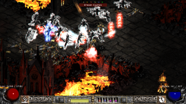
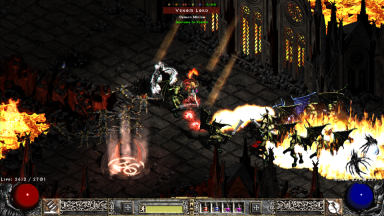
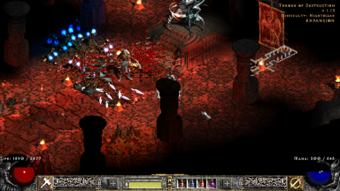
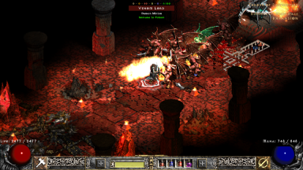

# d2gl-custom-shader-presets
Additional slang shader presets for D2GL

## Scaling in D2GL

Recently **bayaraa** introduced support for multi-pass shaders in [D2GL](https://github.com/bayaraa/d2gl). [cnc-ddraw](https://github.com/FunkyFr3sh/cnc-ddraw) had basic support for single-pass shaders for quite some time, so what really changed? *D2GL* offers HD text, which means that text is rendered separately. This means we aren't concerned with text readability and shaders can be pushed a bit harder without sacrifices. Moreover due to multi-pass support combining shaders gives more options.

## Challanges of scaling D2

## Usage

## Screenshots

 
 
 

## Credits

**Hyllian** and **fishku** for providing useful tips.
