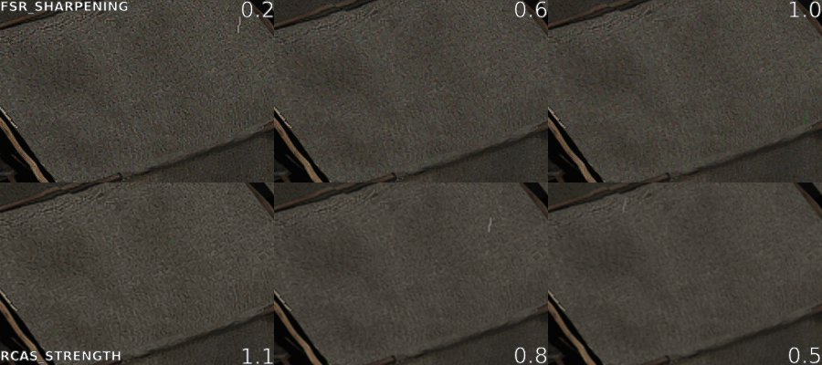
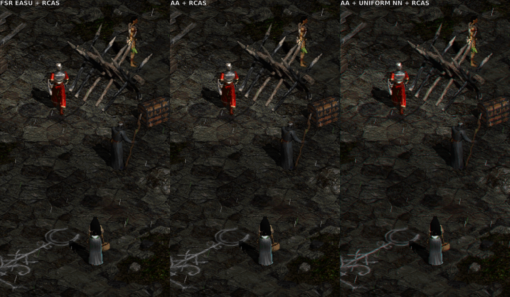
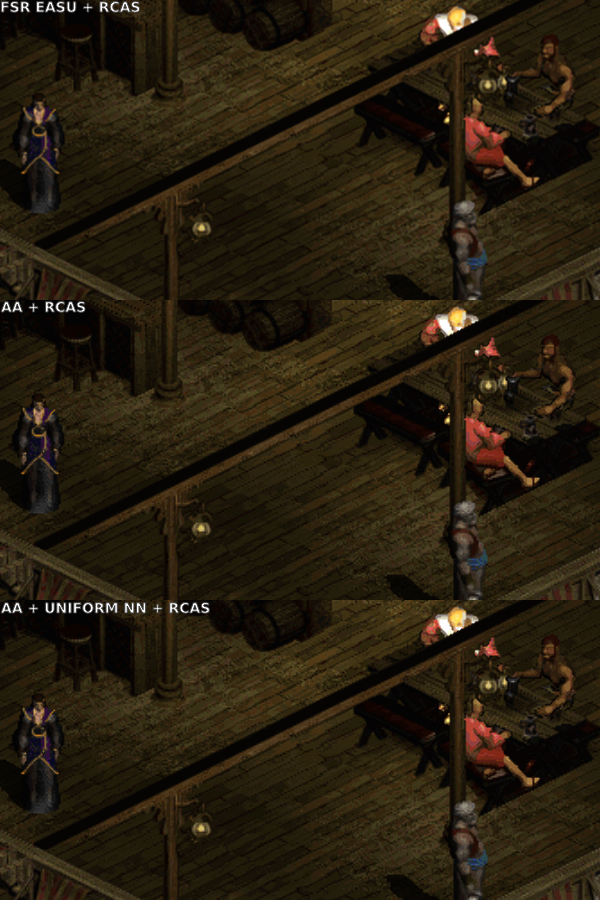

# d2gl-custom-shader-presets
Additional slang shader presets for D2GL

## Usage

Copy provided `data` folder into you base Diablo II directory, so path looks something like that:

`E:\Diablo II\data\shaders\presets\aa+uniform-nn+rcas.slangp`

Launch game with `-direct` flag and select `aa+uniform-nn+rcas` shader preset within *D2GL* (Ctrl+o shortcut).

## Screenshots

All screenshot were taken at 1068x600 in-game resolution, upscaled to 1920x1080 via *D2GL* with FXAA filtering disabled.

 
 
 

## Scaling in D2GL

Recently **bayaraa** introduced support for multi-pass shaders in [D2GL](https://github.com/bayaraa/d2gl). [cnc-ddraw](https://github.com/FunkyFr3sh/cnc-ddraw) had basic support for single-pass shaders for quite some time, so what really changed? *D2GL* offers HD text, which means that text is rendered separately. This means we aren't concerned with text readability and shaders can be pushed a bit harder without sacrifices. Moreover due to multi-pass support combining shaders gives more options.

## Challanges of scaling D2

[Libretro shaders](https://github.com/libretro/slang-shaders) are mostly oriented toward scaling older systems, where resolution is pretty low (common resolution for *SNES* is 256x224 as an example). Those shaders are also typically created with integer scaling in mind: 2x, 3x, 4x of original size and so on. On the other hand, common resolution for *Diablo 2* is 1068x600 (when used with [SGD2FreeRes](https://github.com/mir-diablo-ii-tools/SlashGaming-Diablo-II-Free-Resolution) for wide resolution support) and that means fractional scaling, when upscaling to something like 1080p (1920x1080). This means that most shaders will look bad (mostly due to artifacts). Prevously something like *windowed/jinc2* gave decent results, but now most players will probably switch to new addition: *FSR*.

## Beyond FSR

[FSR 1.0](https://gpuopen.com/fidelityfx-superresolution/#howitworks) is made out of two shaders: *EASU* (Edge-Adaptive Spatial Upsampling) and *RCAS* (Robust Contrast-Adaptive Sharpening). Basically first one is responsible for edge detection and upscaling, second one is used for sharpening. Sharpening shader can be additionally tuned with some parameters, which is great since if sharpening is too aggresive it can create [ringing artifacts](https://en.wikipedia.org/wiki/Ringing_artifacts). Which is the case with default settings that are used inside *D2GL* - here is showcase (first row) with different values (default is 0.2):

Currently *D2GL* ignores parameters inside slang presets (*.slangp* extension) and that means they can be changed only directly in slang shader files (*.slang* extension). If you using *FSR* I would recommend changing `FSR_SHARPENING` inside `data/shaders/fsr/shaders/fsr-pass1.slang` to value between 0.4 and 1.0. So for example with 0.7, line would look like this:

`#pragma parameter FSR_SHARPENING "FSR RCAS Sharpening Amount (Lower = Sharper)" 0.7 0.0 2.0 0.1`

Lets go back to previous image and look at second row. Here different implementation of *RCAS* is used. **fishku** re-implemented this shader, enabling some additional features like Luma denoiser. This means that sharepining can be pushed bit further without creating noticable artificats. He also reversed meaning of values: higher = sharper. I think switching to *FSR EASU + fishku RCAS* is better option than using stock *FSR*. `RCAS_STRENGTH` can be adjusted in `data/shaders/sharpen/shaders/rcas.slang`, example for 0.8 value:

`#pragma parameter RCAS_STRENGTH "Strength of RCA sharpening" 0.8 0.0 1.1 0.05`

## Better than EASU?

Most general upscalers are yielding similar results to *EASU*. You can also try to use more specilized upscalers like *ScaleFX* or *XBR* for pre-scaling at fixed integer value e.g. 2x and then downscale using something like *cubic/b-spline*, followed by sharpening pass. Most of those combinations don't improve over *EASU*. I personally settled down on using *Anti-Aliasing 4.0* shader, which does less than EASU and in my opinion provides more natural results at cost of more [jaggies](https://en.wikipedia.org/wiki/Jaggies). 

Additionally I used [Uniform Nearest](https://github.com/gizmo98/gizmo-crt-shader) shader created by **Gizmo**. It creates CRT-like effects than aren't overwhelming like scanlines. It helps with hiding some upscaling limitations, sprites in move look especially good and whole image composition is very tasteful compared to usual CRT shaders. I created some comparisons using static images:

Only downside of using *Uniform Nearest* is that at some resolutions (specific values), it can created red/green lines alongside straight verticals/horizonals (typically menu or/and inventory). If you are using windowed mode, enlarging width/height by 1px can help with those.

There is also nothing stopping you from using FXAA filtering as option in *D2GL*. I disabled it only, because it is easier to compare images this way.

## Credits

**Hyllian** and **fishku** for providing useful tips.
